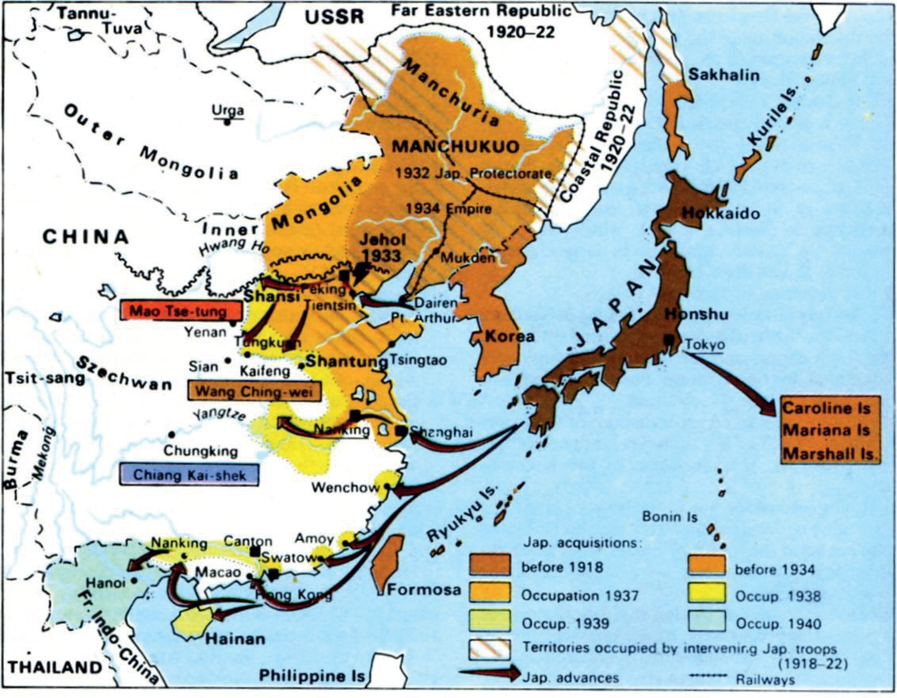

# Welcome to SAASS-667

---

## Who Am I?

  - **David** Benson
  - cyberstratprof@gmail.com
  - (703) 638-3721

---

---

# FAQs

+++

## What's up with the final assignment?

Benson's Axiom: If computers are making your life harder, you are probably using them wrong.

+++

## Why so little cyber in the ``Cyber'' course? 

If there is one thing you should have learned from SAASS, it's that important concepts are never simple.

+++

## How Much ``cyber'' do I need to know?

+++

## Can I bring my computer?

---

# The Course

---

## You are nearer the darkness than ever before

+++

## Progress of Course

  1. Information's role in "action"
    - Organizations vs. Non-organizations
  2. Information Acquisition and Integration
  3. New information environment

---

## Information In Action

+++

## Network Lexicon

+++

## Organizations

+++

## Doing Things With Networks Alone

+++

## Using Information to Stop People Doing Things

+++

## Getting and Using information

+++

## Big Data &isin; Modern Analysis

+++

## Organizational Problems Using Information

---

## New Information Environment

+++

## Cybersecurity I & II

+++

## Information Strategy

+++

## Information at the International Level

---

# What are your questions?

